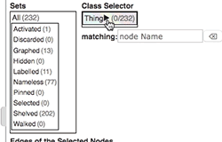
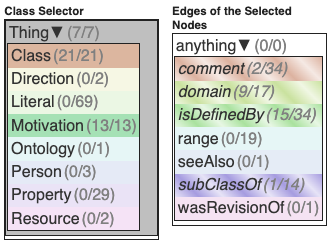

# ColorTreePicker

**ColorTreePicker** is a hierarchical tree controller designed to allow the selection and manipulation of branches and nodes. It is built on top of a custom web component and offers a flexible way to handle tree-like structures with visual feedback on selection states.

## Features

- **Expandable/Collapsible Nodes:** Users can toggle between collapsed and expanded states of nodes.
- **Color Coding:** Nodes and branches are color-coded based on their selection state: showing, unshowing, or mixed.
- **Gradient Display:** Collapsed branches inherit a gradient representing their children's states.

### Example GIFs

#### Class Selector


#### Nodes and Edges View


## Installation

To install and run the **ColorTreePicker** in your project:

1. Clone the repository:
   ```bash
   git clone https://github.com/your-username/colortreepicker.git
   cd colortreepicker
   ```

2. Install dependencies:
   ```bash
   npm install
   ```

3. Build the project:
   ```bash
   npm run build
   ```

4. Open `index.html` in your browser to see the demo.

## Usage

The **ColorTreePicker** can be integrated into any web page by adding the custom `<color-tree-picker>` element and populating it with a tree structure.

### Example:

```html
<color-tree-picker id="demo-tree-picker" use-name-as-label="true"></color-tree-picker>

<script>
    customElements.whenDefined('color-tree-picker').then(() => {
        const treePicker = document.getElementById('demo-tree-picker');

        const treeData = [
            { id: 'root', parent_id: '/', name: 'Root' },
            { id: 'branch1', parent_id: 'root', name: 'Branch 1' },
            { id: 'branch2', parent_id: 'root', name: 'Branch 2' },
            { id: 'leaf1', parent_id: 'branch1', name: 'Leaf 1' },
            { id: 'leaf2', parent_id: 'branch1', name: 'Leaf 2' },
            { id: 'leaf3', parent_id: 'branch2', name: 'Leaf 3' }
        ];

        treeData.forEach(item => {
            treePicker.add(item.id, item.parent_id, item.name);
        });

        treePicker.expand_all();
    });
</script>
```

## File Structure

### `src/`

- `coloredtreepicker.js`: The main component that extends `TreePicker`, managing the colorization and event handling for the tree structure.
- `treepicker.js`: A base class providing functionality for hierarchical tree control (collapsing/expanding, adding nodes, etc.).
- `hsl.js`: Contains utility functions for converting HSL values to RGB.
- `uniquer.js`: A helper utility for converting strings into unique, DOM-safe IDs.

### `dist/`

- Contains the bundled JavaScript after running `npm run build`.

### `docs/`

- Images and GIFs demonstrating the functionality of **ColorTreePicker**.

## License

This project is licensed under the MIT and GPL License.

## Author

Shawn Murphy ([smurp.com](http://smurp.com))
